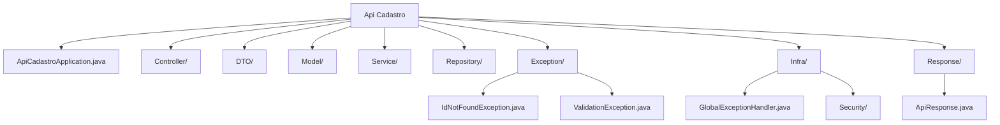

```mermaid
graph TD
    A[Api Cadastro] --> B[ApiCadastroApplication.java]
    A --> C[Controller/]
    A --> D[DTO/]
    A --> E[Model/]
    A --> F[Service/]
    A --> G[Repository/]
    A --> H[Exception/]
    A --> I[Infra/]
    A --> J[Response/]

    H --> HA[IdNotFoundException.java]
    H --> HB[ValidationException.java]

    I --> IA[GlobalExceptionHandler.java]
    I --> IB[Security/]

    J --> JA[ApiResponse.java]
```