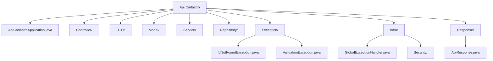

### Estrutura de pastas



### Tabelas do banco de dados
```sql
CREATE TABLE curso (
    id SERIAL PRIMARY KEY,
    nome VARCHAR(255)
);

CREATE TABLE turno (
    id SERIAL PRIMARY KEY ,
    descricao VARCHAR(255)
);

CREATE TABLE disciplina (
    id SERIAL PRIMARY KEY ,
    nome VARCHAR(255)
);

CREATE TABLE professor (
    id SERIAL PRIMARY KEY ,
    nome VARCHAR(255)
);

CREATE TABLE dia_semana (
    id SERIAL PRIMARY KEY ,
    descricao VARCHAR(255)
);

CREATE TABLE turma (
    id SERIAL PRIMARY KEY ,
    nome VARCHAR(255),
    semestre INTEGER,
    ano INTEGER,
    id_curso INTEGER,
    id_turno INTEGER,
    FOREIGN KEY (id_curso) REFERENCES curso(id) ON DELETE CASCADE,
    FOREIGN KEY (id_turno) REFERENCES turno(id) ON DELETE CASCADE
);

CREATE TABLE matriz (
    id SERIAL PRIMARY KEY ,
    id_turma INTEGER,
    id_disciplina INTEGER,
    FOREIGN KEY (id_turma) REFERENCES turma(id) ON DELETE CASCADE,
    FOREIGN KEY (id_disciplina) REFERENCES disciplina(id) ON DELETE CASCADE
);

CREATE TABLE disciplina_curso (
    id SERIAL PRIMARY KEY ,
    id_curso INTEGER,
    id_disciplina INTEGER,
    FOREIGN KEY (id_curso) REFERENCES curso(id) ON DELETE CASCADE,
    FOREIGN KEY (id_disciplina) REFERENCES disciplina(id) ON DELETE CASCADE
);

CREATE TABLE disponibilidade (
    id SERIAL PRIMARY KEY ,
    turno INTEGER,
    dia_semana INTEGER,
    semestre INTEGER,
    ano INTEGER,
    id_professor INTEGER,
    id_disciplina INTEGER,
    FOREIGN KEY (id_professor) REFERENCES professor(id) ON DELETE CASCADE,
    FOREIGN KEY (id_disciplina) REFERENCES disciplina(id) ON DELETE CASCADE
);

CREATE TABLE grade (
    id SERIAL PRIMARY KEY ,
	id_turma INTEGER,
    seg INTEGER,
    ter INTEGER,
    qua INTEGER,
    qui INTEGER,
    sex INTEGER,
    sab INTEGER,
    versao INTEGER,
    status INTEGER,
	FOREIGN KEY (id_turma) REFERENCES turma(id) ON DELETE CASCADE
);

CREATE TABLE erros (
    id SERIAL PRIMARY KEY,
    versao INTEGER NOT NULL
    erros VARCHAR(255) NOT NULL
);

CREATE TABLE config (
    id SERIAL PRIMARY KEY,
    campo VARCHAR(255) NOT NULL
    valor INTEGER NOT NULL
);

```