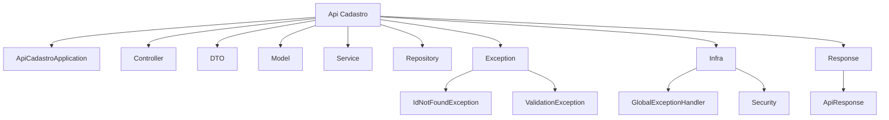

```mermaid
graph TD
    A[Api Cadastro] --> B[ApiCadastroApplication]
    A --> C[Controller]
    A --> D[DTO]
    A --> E[Model]
    A --> F[Service]
    A --> G[Repository]
    A --> H[Exception]
    A --> I[Infra]
    A --> J[Response]

    H --> HA[IdNotFoundException]
    H --> HB[ValidationException]

    I --> IA[GlobalExceptionHandler]
    I --> IB[Security]

    J --> JA[ApiResponse]
```