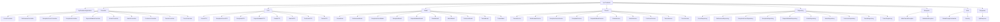

```mermaid
graph TD
    A[Api Cadastro] --> B[ApiCadastroApplication]
    A --> C[Controller]
    A --> D[DTO]
    A --> E[Model]
    A --> F[Service]
    A --> G[Repository]
    A --> H[Exception]
    A --> I[Infra]
    A --> J[Response]

    C --> CA[CursoController]
    C --> CB[DiaSemanaController]
    C --> CC[DisciplinaCursoController]
    C --> CD[DisciplinaController]
    C --> CE[DisponibilidadeController]
    C --> CF[GradeController]
    C --> CG[MatrizController]
    C --> CH[ProfessorController]
    C --> CI[TurmaController]
    C --> CJ[TurnoController]

    D --> DA[CursoDTO]
    D --> DB[DisciplinaCursoDTO]
    D --> DC[DisciplinaDTO]
    D --> DD[DisponibilidadeDTO]
    D --> DE[GradeDTO]
    D --> DF[MatrizDTO]
    D --> DG[ProfessorDTO]
    D --> DH[TurmaDTO]

    E --> EA[CursoModel]
    E --> EB[DiaSemanaModel]
    E --> EC[DisciplinaCursoModel]
    E --> ED[DisciplinaModel]
    E --> EE[DisponibilidadeModel]
    E --> EF[GradeModel]
    E --> EG[MatrizModel]
    E --> EH[ProfessorModel]
    E --> EI[TurmaModel]
    E --> EJ[TurnoModel]

    F --> FA[CursoService]
    F --> FB[DiaSemanaService]
    F --> FC[DisciplinaCursoService]
    F --> FD[DisciplinaService]
    F --> FE[DisponibilidadeService]
    F --> FF[GradeService]
    F --> FG[MatrizService]
    F --> FH[ProfessorService]
    F --> FI[TurmaService]
    F --> FJ[TurnoService]


    G --> GA[CursoRepository]
    G --> GB[DiaSemanaRepository]
    G --> GC[DisciplinaCursoRepository]
    G --> GD[DisciplinaRepository]
    G --> GE[DisponibilidadeRepository]
    G --> GF[GradeRepository]
    G --> GG[MatrizRepository]
    G --> GH[ProfessorRepository]
    G --> GI[TurmaRepository]
    G --> GJ[TurnoRepository]

    H --> HA[IdNotFoundException]
    H --> HB[ValidationException]

    I --> IA[GlobalExceptionHandler]
    I --> IB[Security]

    J --> JA[ApiResponse]


```