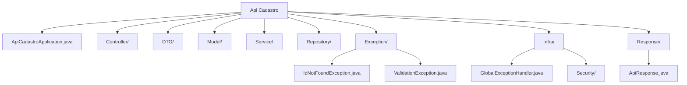

### Estrutura de pastas



### Tabelas do banco de dados
```sql
CREATE TABLE curso (
    id SERIAL PRIMARY KEY,
    nome VARCHAR(255)
);

CREATE TABLE turno (
    id SERIAL PRIMARY KEY ,
    descricao VARCHAR(255)
);

CREATE TABLE disciplina (
    id SERIAL PRIMARY KEY ,
    nome VARCHAR(255)
);

CREATE TABLE professor (
    id SERIAL PRIMARY KEY ,
    nome VARCHAR(255)
);

CREATE TABLE dia_semana (
    id SERIAL PRIMARY KEY ,
    descricao VARCHAR(255)
);

CREATE TABLE turma (
    id SERIAL PRIMARY KEY ,
    nome VARCHAR(255),
    semestre INTEGER,
    ano INTEGER,
    id_curso INTEGER,
    id_turno INTEGER,
    FOREIGN KEY (id_curso) REFERENCES curso(id) ON DELETE CASCADE,
    FOREIGN KEY (id_turno) REFERENCES turno(id) ON DELETE CASCADE
);

CREATE TABLE matriz (
    id SERIAL PRIMARY KEY ,
    id_turma INTEGER,
    id_disciplina INTEGER,
    FOREIGN KEY (id_turma) REFERENCES turma(id) ON DELETE CASCADE,
    FOREIGN KEY (id_disciplina) REFERENCES disciplina(id) ON DELETE CASCADE
);

CREATE TABLE disciplina_curso (
    id SERIAL PRIMARY KEY ,
    id_curso INTEGER,
    id_disciplina INTEGER,
    FOREIGN KEY (id_curso) REFERENCES curso(id) ON DELETE CASCADE,
    FOREIGN KEY (id_disciplina) REFERENCES disciplina(id) ON DELETE CASCADE
);

CREATE TABLE disponibilidade (
    id SERIAL PRIMARY KEY ,
    semestre INTEGER,
    ano INTEGER,
    id_dia_semana INTEGER,
    id_professor INTEGER,
    id_turno INTEGER,
    id_disciplina INTEGER,
    FOREIGN KEY (id_professor) REFERENCES professor(id) ON DELETE CASCADE,
    FOREIGN KEY (id_disciplina) REFERENCES disciplina(id) ON DELETE CASCADE,
    FOREIGN KEY (id_dia_semana) REFERENCES dia_semana(id) ON DELETE CASCADE,
    FOREIGN KEY (id_turno) REFERENCES turno(id) ON DELETE CASCADE
);

CREATE TABLE grade (
    id SERIAL PRIMARY KEY ,
	id_turma INTEGER,
    seg INTEGER,
    ter INTEGER,
    qua INTEGER,
    qui INTEGER,
    sex INTEGER,
    sab INTEGER,
    versao INTEGER,
    status INTEGER,
	FOREIGN KEY (id_turma) REFERENCES turma(id) ON DELETE CASCADE
);

CREATE TABLE erros (
    id SERIAL PRIMARY KEY,
    versao INTEGER NOT NULL,
    erros VARCHAR(255) NOT NULL
);

CREATE TABLE config (
    id SERIAL PRIMARY KEY,
    campo VARCHAR(255) NOT NULL,
    valor INTEGER NOT NULL
);
-- ______________________________________

INSERT INTO turno (descricao) VALUES
('Matutino'),   -- 1
('Vespertino'), -- 2
('Noturno');    -- 3

INSERT INTO dia_semana (descricao) VALUES
('Domingo'),          -- 1
('Segunda-feira'),    -- 2
('Terça-feira'),      -- 3
('Quarta-feira'),     -- 4
('Quinta-feira'),     -- 5
('Sexta-feira'),      -- 6
('Sábado');           -- 7

INSERT INTO professor (nome) VALUES
('Alex Delgado Goncalves Casanas'),        -- 1
('Alfredo Manoel de Oliveira Neto'),       -- 2
('Eliel Silva da Cruz'),                   -- 3
('Fernando Antonio Fernandes Anselmo'),    -- 4
('Flavia Maria Alves Lopes'),              -- 5
('Gabriel de Oliveira Alves'),             -- 6
('Gleidson Porto Batista'),                -- 7
('Herbert Antonio Moreira Severino'),      -- 8
('Ione Ferrarini Goulart'),                -- 9
('Kadidja Valeria Reginaldo de Oliveira'), -- 10
('Karla Roberto Sartin'),                  -- 11
('Leonardo Fillipe Marinho Araujo'),       -- 12
('Leticia Toledo Maia Zoby'),              -- 13
('Rafael Soares de Almeida'),              -- 14
('Relyson Lima de Magalhaes Ramos'),       -- 15
('Welton Dias de Lima'),                   -- 16
('Wilson Amaral Martins');                 -- 17

INSERT INTO curso (nome) VALUES
('Ciência da Computação (Bacharelado)'),          -- 1
('CST em Análise e Desenvolvimento de Sistemas'), -- 2
('Engenharia de Software (Bacharelado)'),         -- 3
('Sistemas de Informação (Bacharelado)');         -- 4

INSERT INTO disciplina (nome) VALUES
('Análise e Projeto de Sistemas'),                -- 1
('Análise e Projeto de Sistemas II'),             -- 2
('Ciência de Dados e Aprendizagem de Máquina'),   -- 3
('Computação Gráfica'),                           -- 4
('Engenharia de Software'),                       -- 5
('Estruturas de Dados I'),                        -- 6
('Estruturas de Dados II'),                       -- 7
('Fundamentos de Inteligência Artificial'),       -- 8
('Gestão de Projeto em Sistemas de Informação'),  -- 9
('Gestão de Sistemas de Informação e Métodos'),   -- 10
('Laboratório de Banco de Dados'),                -- 11
('Paradigmas de Linguagens de Programação'),      -- 12
('Programação Para Dispositivos Móveis'),         -- 13
('Programação Web'),                              -- 14
('Projeto de Linguagens de Programação'),         -- 15
('Redes de Computadores'),                        -- 16
('Segurança e Auditoria de Sistemas'),            -- 17
('Sistemas Operacionais'),                        -- 18
('Técnicas de Desenvolvimento de Algoritmos'),    -- 19
('Técnicas de Programação'),                      -- 20
('Teoria Geral da Administração');                -- 21

INSERT INTO disciplina_curso (id_curso, id_disciplina) VALUES
(1, 1),
(1, 3),
(1, 4),
(1, 6),
(1, 7),
(1, 12),
(1, 14),
(1, 15),
(1, 16),
(1, 18),
(1, 19),
(2, 2),
(2, 5),
(2, 13),
(2, 14),
(2, 16),
(2, 18),
(2, 19),
(3, 5),
(3, 14),
(3, 20),
(4, 1),
(4, 5),
(4, 8),
(4, 9),
(4, 10),
(4, 11),
(4, 16),
(4, 17),
(4, 19),
(4, 21);


```
